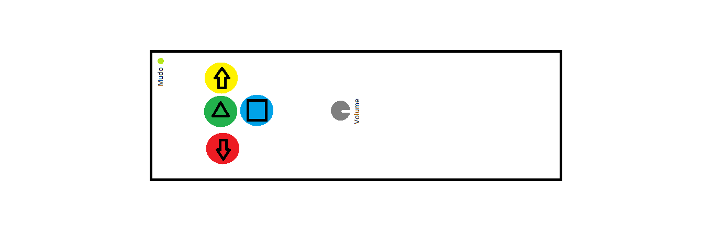

# Projeto Embarcados

Desenvolvendo um controle remoto.

## Entrega 1

### Integrantes

- Vinícius Matheus Morales

### Ideia

A ideia é fazer um controle remoto para funcionalidades básicas e essenciais do Youtube.

### Nome

Youtuberson

### Usuários 

Pessoas que gostariam de escutar música no Youtube sem precisar estar próximo ao computador.

### Software/Jogo 

Youtube.

### Jornada do usuários (3 pts)

O primeiro usuário está arrumando sua casa para uma pequena festa entre amigos, na hora de arrumar o som da casa ele se depara com um problema, não tem como controlar a música sem estar diretamente mexendo no computador, o que ele considera desrespeitoso com os convidados. Por sorte ele se lembra de um amigo que produziu um controle bluetooth para seu projeto de Computação Embarcada no Insper e pede sua ajuda. Seu amigo de bom grado o ajuda, mostrando para o usuário que o controle possui 4 botões coloridos (verde, vermelho, amarelo e azul), um LED, um controlador para o volume (potenciômetro), uma placa interessante e muitos fios. Rapidamente ele entende o funcionamento do controle e já começa a usar, podendo pausar, dar play, voltar em 5 segundos, avançar em 5 segundos, colocar em tela cheia e controlar o volume. Então o primeiro usuário pôde aproveitar sua festa sem que precisasse levantar e ir até o computador para mexer nessas funcionalidades do Youtube, gerando também bastante conversa sobre o controle diferente e engraçado que ele usava.

O segundo usuário é um pai que gosta de estar próximo aos filhos enquanto eles consomem conteúdos do Youtube. Algumas vezes ele se sentiu mal por ter que impedir seus filhos de verem algo pegando diretamente nos seus dispositivos eletrônicos e gerando estresse. Por sorte seu filho mais velho é estudante de Engenharia da Computação no Insper e em seu projeto de Computação Embarcada fez um controle remoto para o Youtube. Seu filho explicou como funcionava e ele achou ótimo, pois o que ele mais queria era poder pausar os vídeos para impedir que seus filhos assistissem a algo que ele não considera válido.

### Comandos/ Feedbacks (2 pts)

Play/pause, voltar 5 segundos, avançar 5 segundos, ativar/desativar tela cheia, controlar o volume e saber quando está mudo.

## In/OUT (3 pts)

- Play/Pause: Botão verde
- Voltar 5 segundos: Botão vermelho
- Avançar 5 segundos: Botão amarelo
- Ativar/Desativar tela cheia: Botão azul
- Volume: Potenciômetro
- Flag de mudo: LED

### Design (2 pts)

